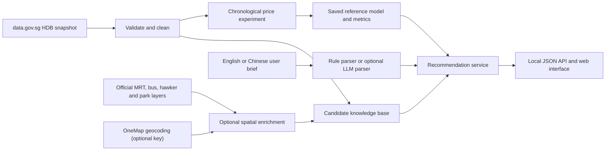

# System Architecture

HomeLens SG separates reproducible offline mining from low-latency recommendation.
The core path works without any API key.

## Offline data path

1. `scripts/build_dataset.py` downloads or reads a versioned raw snapshot, validates
   its schema, keeps an audit table, and builds block + flat-type candidates from the
   latest 24 complete months.
2. `scripts/download_layers.py` obtains four small public GeoJSON layers without a
   key.
3. `scripts/enrich_geospatial.py` is optional. After OneMap credentials are added, it
   geocodes block addresses and computes straight-line access features.
4. `scripts/train_model.py` compares a hierarchical-median baseline with a random
   forest on a strict chronological holdout.
5. `scripts/explore_data.py` creates reproducible figures and summary files.

Every generated source, table and model has a manifest or metrics file under
`artifacts/`. An unfinished current month is kept for audit but excluded from
candidate, EDA and model results.

## Online recommendation path

The request contains a budget and optional natural-language or form preferences.
`intent.py` converts the brief into a validated schema. `recommender.py` applies all
hard constraints first, then ranks eligible candidates with transparent weighted
criteria. `service.py` adds the saved model only as a reference estimate and returns
evidence, warnings and score components. The LLM never supplies housing facts.

The built-in web server is for a local demonstration only. It binds to loopback,
accepts JSON only, blocks cross-origin requests and rate-limits recommendation calls.
API response storage is disabled for the optional OpenAI request, although provider
safety-log policies may still apply.

## Main implementation modules

| Module | Responsibility |
| --- | --- |
| `data/hdb.py` | Official download, retry, schema check and snapshot manifest |
| `features.py` | Cleaning, candidate aggregation and market features |
| `geospatial.py` | Address cache, Haversine distance and radius counts |
| `price_model.py` | Time split, baseline, random forest and metrics |
| `intent.py` | English/Chinese rules and optional structured LLM extraction |
| `recommender.py` | Hard filters, normalised scores, Pareto flags and explanations |
| `service.py` | End-to-end request orchestration |
| `web.py` | Local HTTP API and static frontend |
